# Cấu hình Push Notification

OMICALL iOS SDK - Thiết lập thông tin Push Notification

Tài liệu này giải thích cách lấy thông tin đăng nhập bạn cần để nhận cuộc gọi đến trên OMICALL iOS SDK bằng PushKit. Để nhận cuộc gọi đến, bạn phải:

1. Bật các dịch vụ VoIP trong ứng dụng của bạn.
2. Tạo chứng chỉ dịch vụ VoIP.
3. Tạo hồ sơ cấp phép cho ứng dụng của bạn.
4. Tạo thông tin xác thực đẩy (tệp .p12) bằng chứng chỉ VoIP.
5. Cập nhật thông tin trên bảng điều khiển OMICALL.

Thực hiện từng bước này như sau.

**Bật các dịch vụ VoIP trong ứng dụng của bạn**

Để bật các dịch vụ VoIP từ Xcode, hãy chọn tab Capabilities, sau đó:

1. Đảm bảo đã thêm Push Notifications and Background Modes.
2. Trong Chế độ nền Background Modes, enable Audio, AirPlay, and Picture in Picture; Voice over IP; Background Fetch; and Remote Notifications settings.

<figure>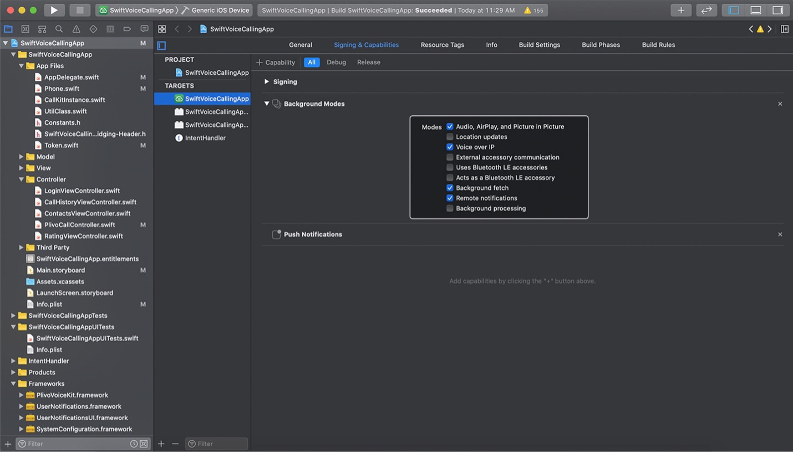<figcaption></figcaption></figure>

1. Trên tab Thông tin, thêm “App provides Voice over IP services” vào danh sách “Required Background Modes”

.

<figure><figcaption></figcaption></figure>

**Thêm Quyền truy cập Microphone/Camera cho ứng dụng**&#x20;

`Mở file cấu hình info.plist để thêm các key sau vào cấu hình`

```markup
<key>NSMicrophoneUsageDescription</key>
<string>Need microphone access for make Call</string>
<key>NSCameraUsageDescription</key>
<string>Need camera access for video call functions</string>
```


**Tạo chứng chỉ dịch vụ VoIP**

Để tạo Chứng chỉ dịch vụ VoIP, hãy tạo yêu cầu ký chứng chỉ (CSR), sau đó tạo chứng chỉ dịch vụ bằng CSR.

**Tạo yêu cầu ký chứng chỉ (CSR)**

Yêu cầu ký chứng chỉ (CSR) là điều kiện tiên quyết để tạo chứng chỉ trong [Dev Center](https://developer.apple.com/membercenter).

&#x20;. Để tạo CSR:

1. Mở quyền truy cập Chuỗi khóa bằng cách chọn “Truy cập chuỗi khóa” trong thư mục Tiện ích.

<figure>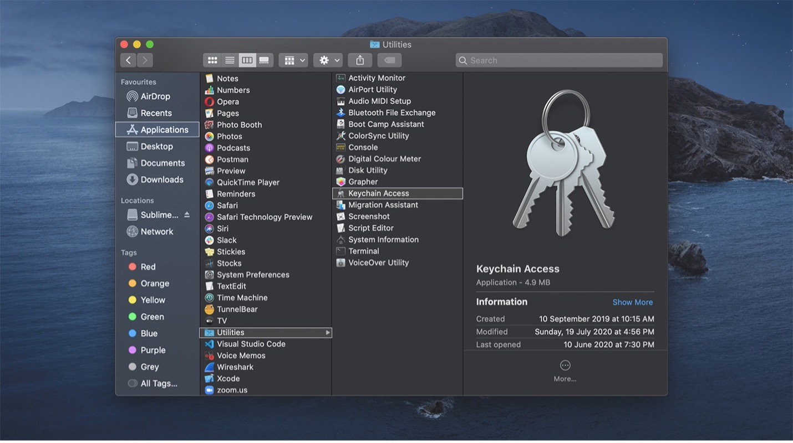<figcaption></figcaption></figure>

1. Từ menu “Truy cập chuỗi khóa”, điều hướng đến **Certificate Assistant > Request a Certificate From a Certificate Authority**

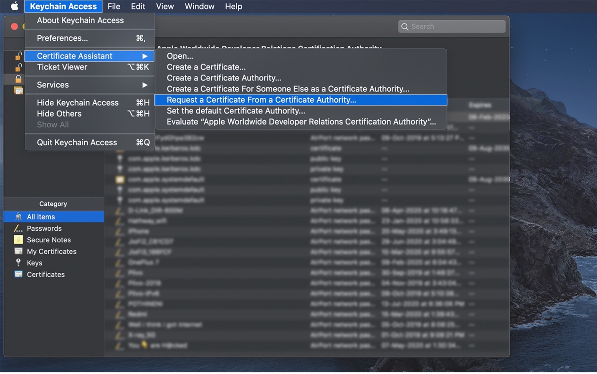

1. Nhập tên mô tả cho CSR của bạn. Ví dụ: ios\_OMICALL\_app.certSignsRequest.
2. Chọn vị trí để lưu nó trên ổ cứng của bạn, sau đó nhấp vào **Lưu** .
3.

    <figure>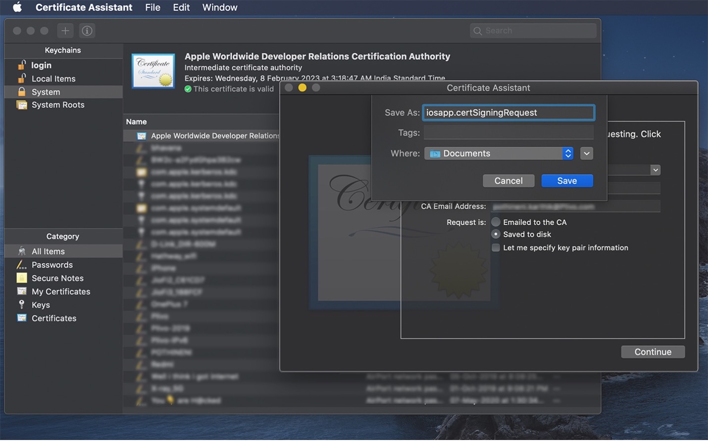<figcaption></figcaption></figure>
4. Đăng nhập vào [Bảng điều khiển dành cho nhà phát triển của Apple](https://developer.apple.com/) .&#x20;

&#x20;

<figure><figcaption></figcaption></figure>

1. Điều hướng đến trang Certificates, Identifiers & Profiles và nhấp vào '+' để thêm chứng chỉ mới.

<figure>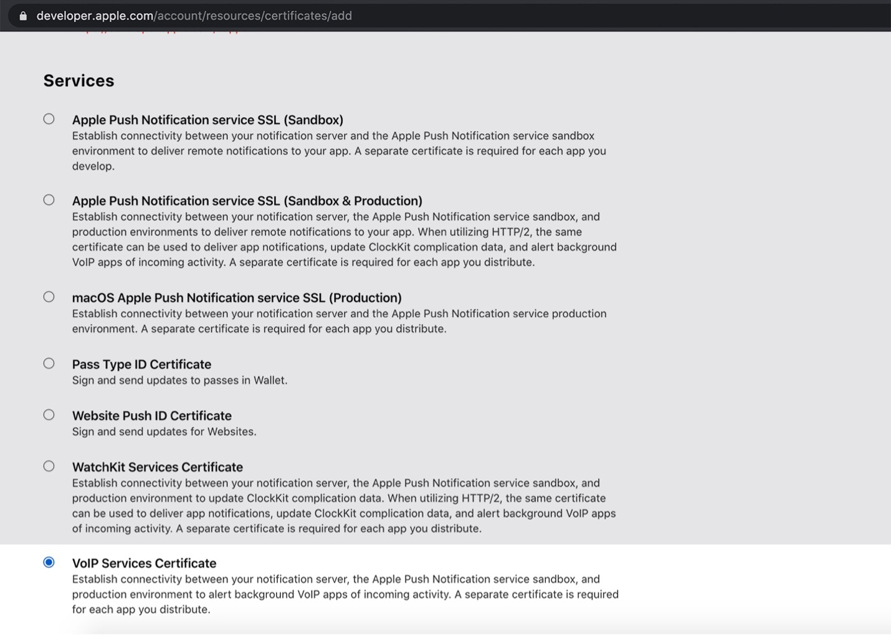<figcaption></figcaption></figure>

1. Trong loại chứng chỉ, hãy chọn VoIP Services Certificate', sau đó nhấp vào Continue.

<figure>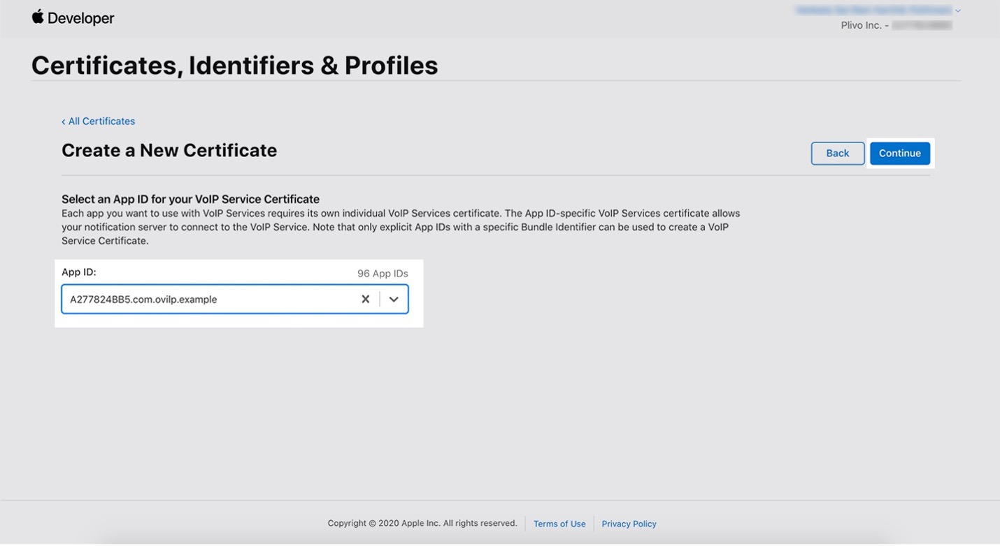<figcaption></figcaption></figure>

1. Nhấp vào Continue để tiếp tục.
2. Từ danh sách ID ứng dụng, hãy chọn ID ứng dụng được liên kết với ứng dụng của bạn.

<figure>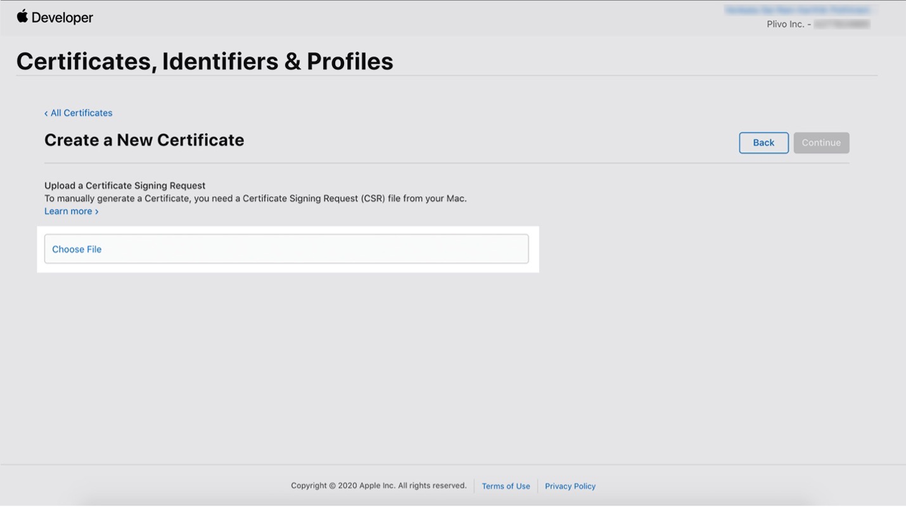<figcaption></figcaption></figure>

1. Để chọn và tải lên tệp CSR được tạo từ Keychain, hãy nhấp vào Choose File.

<figure>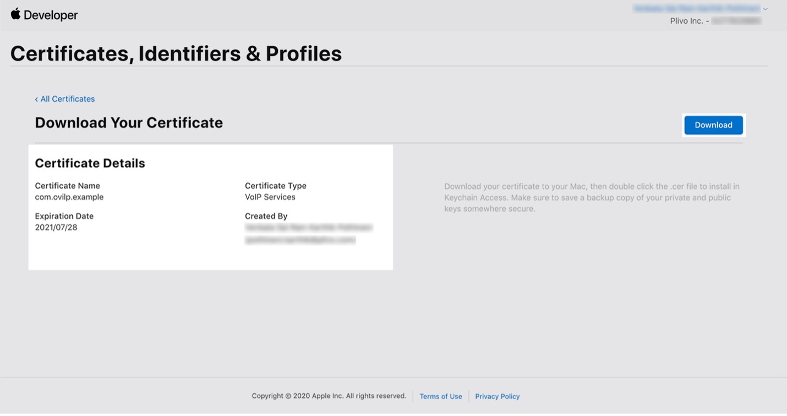<figcaption></figcaption></figure>

1. Để tải xuống và lưu chứng chỉ VoIP, hãy nhấp vào 'Download'.

<figure>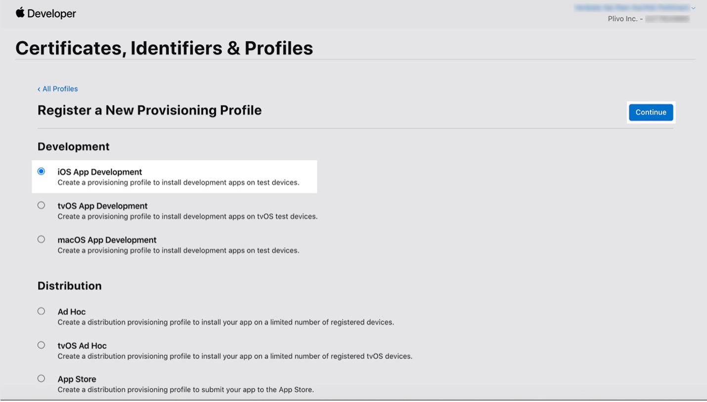<figcaption></figcaption></figure>

**Tạo hồ sơ cấp phép cho ứng dụng của bạn**

Để tạo hồ sơ cấp phép cho ứng dụng của bạn:

1. Điều hướng đến phần Hồ sơ cấp phép trên [Apple Developer Portal](https://developer.apple.com/account/ios/profile/)
2. Nhấp vào “+” để thêm Hồ sơ cấp phép mới.

**Để thiết lập hồ sơ cấp phép cho môi trường thử nghiệm**

1. Chọn Phát triển ứng dụng iOS làm loại hồ sơ cấp phép.
2. Nhấp vào Tiếp tục.
3. Chọn ID ứng dụng của bạn.
4. Chọn chứng chỉ nhà phát triển bạn muốn đưa vào hồ sơ cấp phép này.
5. Chọn thiết bị của nhà phát triển mà bạn muốn đưa vào hồ sơ cấp phép này.
6. Nhập tên cho hồ sơ cấp phép.
7. Nhấp vào Tải xuống để tải xuống và lưu hồ sơ đã tạo.

<figure>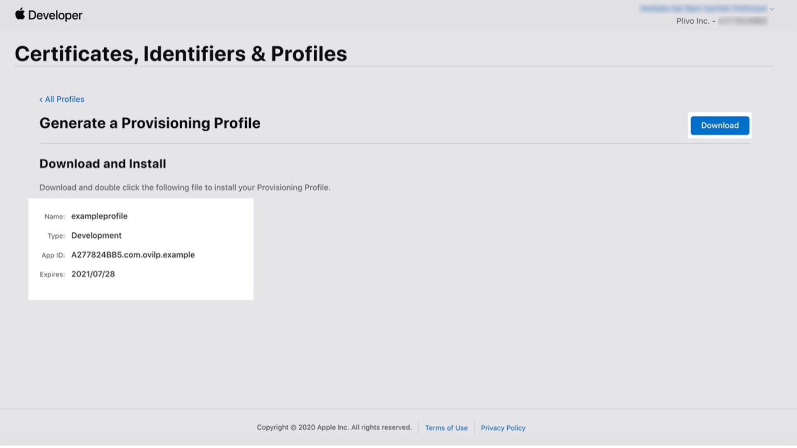<figcaption></figcaption></figure>

**Để thiết lập hồ sơ cấp phép cho môi trường Triển khai ( Production)**

1. Nếu bạn định gửi ứng dụng của mình lên cửa hàng ứng dụng, hãy chọn Cửa hàng ứng dụng trong Phân phối cho môi trường sản xuất. Nếu không, hãy chọn loại phân phối Ad Hoc.

<figure>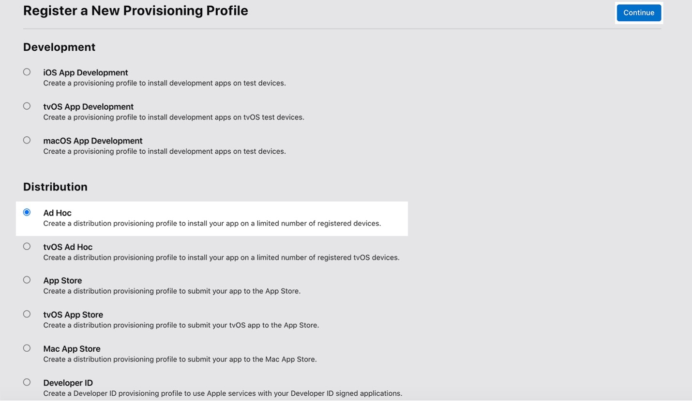<figcaption></figcaption></figure>

1. Nhấp vào Tiếp tục.
2. Chọn ID ứng dụng của bạn.
3. Chọn chứng chỉ phân phối iOS mà bạn muốn đưa vào hồ sơ cấp phép này. Đây phải là chứng chỉ App Store hoặc Ad Hoc cho ứng dụng sản xuất của bạn.
4. Nhập tên cho hồ sơ cấp phép.
5. Nhấp vào Tải xuống để tải xuống và lưu hồ sơ đã tạo.

<figure>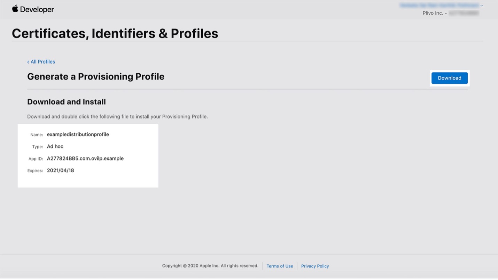<figcaption></figcaption></figure>

**Ghi chú:**

Tệp được tải xuống với phần mở rộng .mobileprovision.

**Tạo thông tin đăng nhập đẩy với Chứng chỉ dịch vụ VoIP của bạn**

Để tạo thông tin đăng nhập đẩy với Chứng chỉ dịch vụ VoIP của bạn:

1.  Xuất Chứng chỉ dịch vụ VoIP của bạn dưới dạng **.p12** tệp từ Truy cập chuỗi khóa.\


    <figure>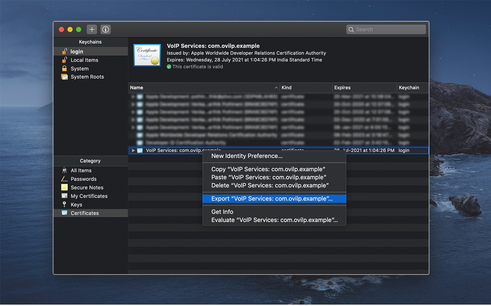<figcaption></figcaption></figure>
2.  Nhập tên duy nhất cho chứng chỉ, sau đó nhấp vào Lưu.\


    <figure>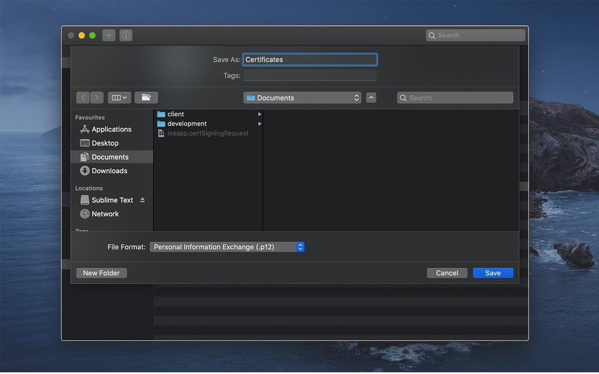<figcaption></figcaption></figure>

**Ghi chú:**

_Bạn không cần nhập mật khẩu để tạo tệp .p12. Bấm OK nếu bạn được nhắc nhập mật khẩu để bảo vệ mục đã xuất. Khóa riêng tư của ứng dụng sẽ được lưu trữ ở định dạng .p12._

\
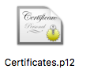

**Cập nhật thông tin trên bảng điều khiển OMICALL**


**1. Cập nhật thông tin trên bảng điều khiển OMICALL**

**Ghi chú:**

Bạn có thể thay đổi môi trường từ thử nghiệm ( Sandbox) sang Triển khai ( Production ), nhưng không thể thay đổi môi trường từ Production sang Sandbox. Để thay đổi môi trường của bạn thành Sandbox từ phiên bản Production, hãy xóa chứng chỉ và tạo một chứng chỉ mới cho Sandbox. Nếu bạn xóa chứng chỉ Production, bạn sẽ ngừng nhận cuộc gọi đến.

1. Mở tệp chứng chỉ ( certificate ), chỉ lấy nội dung khoá từ —–BEGIN CERTIFICATE—– đến—–END CERTIFICATE—–.
2. Từ tệp khóa ( Key ), chỉ lấy nội dung khoá từ —–BEGIN RSA PRIVATE RSA—– và —–END RSA PRIVATE RSA—–.
3. Trong bảng điều khiển OMICALL, đi tới [Cài đặt -> Tích hợp](https://ocp52033.omicrm.vn/config/company/integrated/api) .&#x20;

&#x20;

<figure>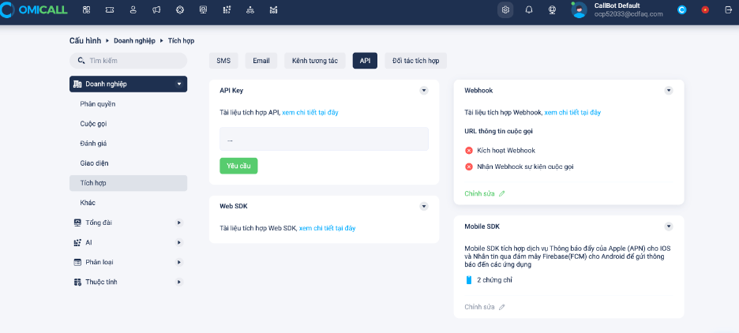<figcaption></figcaption></figure>

Chọn tiếp Chỉnh sửa -> Nhấn nút thêm chứng chỉ

<figure><figcaption></figcaption></figure>

Đối với IOS chúng ta chọn APNS và Android là FCM

&#x20;
