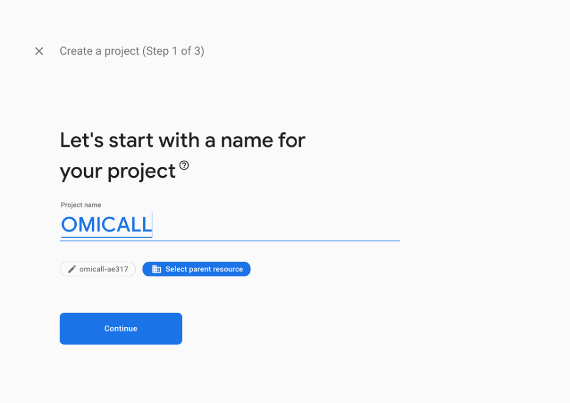
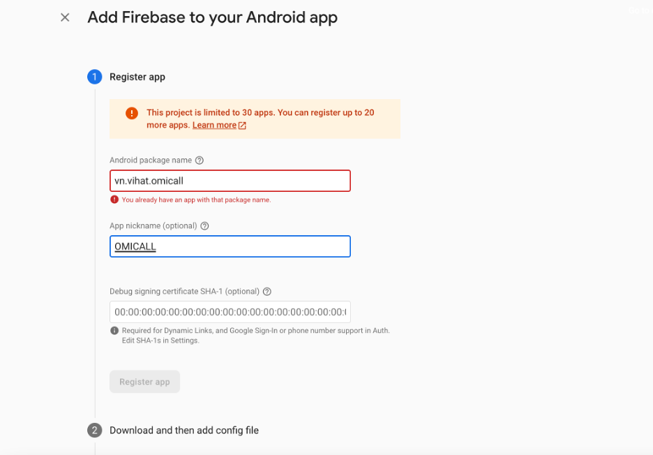
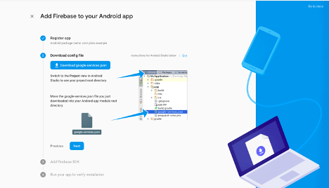
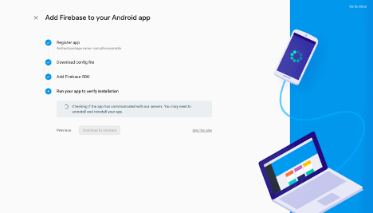
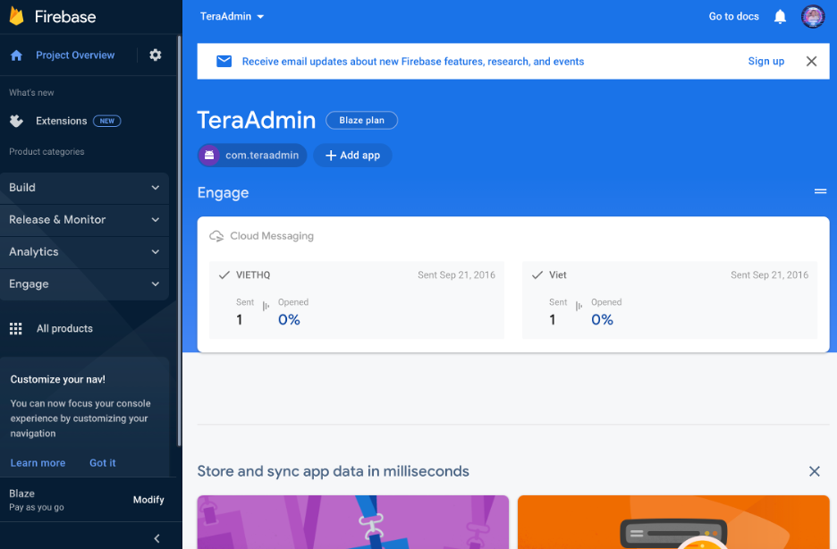
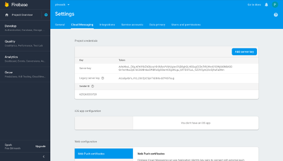
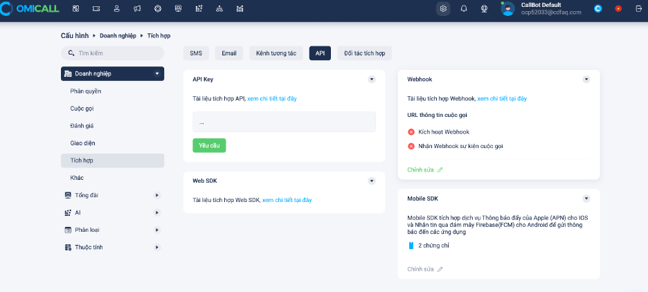
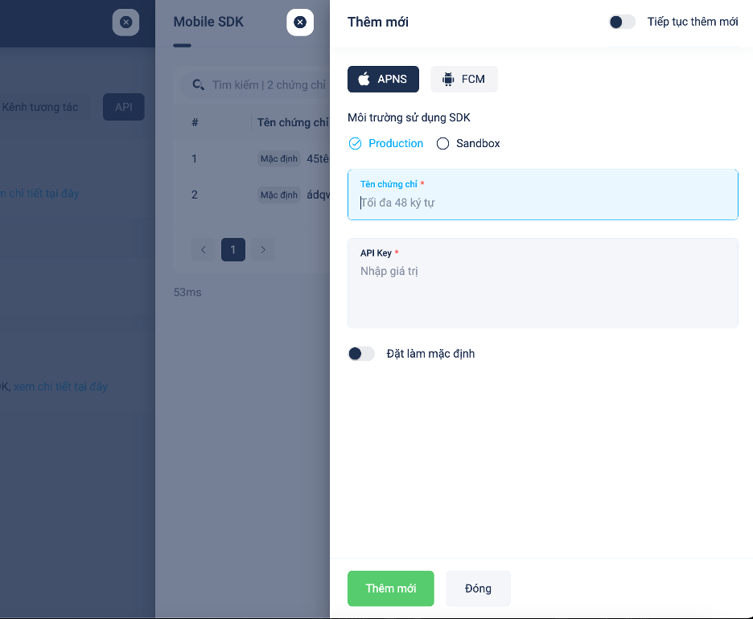

# Cấu hình Push Notification

**Thiết lập Push Notification**

Phần này giải thích cách nhận cuộc gọi đến trên OMICALL Android SDK bằng Firebase. Để nhận cuộc gọi đến, bạn phải:

1. Tạo một dự án trên Firebase.
2. Đăng ký ứng dụng của bạn trên Firebase.
3. Thêm tệp cấu hình Firebase và SDK vào ứng dụng của bạn.
4. Sao chép khóa máy chủ dự án Firebase vào trang tổng quan OMICALL.

Các bước thực hiện như sau:

1. Tạo một dự án trên Firebase
2.

    * Trên [bảng điều khiển Firebase](https://console.firebase.google.com/) , nhấp vào Thêm dự án.
    * Thêm tên dự án và nhấp vào Tạo dự án.&#x20;

    &#x20;
3. Đăng ký ứng dụng của bạn trên Firebase
4.

    * Chuyển đến phần Android trên trang chủ Dự án của bạn.
    * Đăng ký App Android của bạn trên Firebase.&#x20;

    &#x20;

    * Bấm vào Đăng ký ứng dụng.
5. Thêm tệp cấu hình Firebase và SDK vào ứng dụng của bạn
6.

    * Tải xuống tệp Firebase google-services.json.

    

    * Di chuyển google-services.json đã tải xuống vào thư mục gốc mô-đun ứng dụng Android của bạn.
    * Nhấp vào Tiếp theo.
    * Thực hiện cập nhập cấu hình Gradle của ứng dụng Android của bạn theo hướng dẫn.

    .png>)

    * Chờ xác minh hoàn tất, sau đó tiếp tục đến bảng điều khiển.

    
7. Sao chép khóa máy chủ dự án Firebase vào trang tổng quan OMICALL
8.  Vào phần cài đặt của dự án -> Cloud Messaging để lấy khoá gửi tin thông báo . &#x20;

    

&#x20;

9\. Trong bảng điều khiển OMICALL, đi tới [Cài đặt -> Tích hợp](https://ocp52033.omicrm.vn/config/company/integrated/api) .&#x20;

&#x20;

Chọn tiếp Chỉnh sửa -> Nhấn nút thêm chứng chỉ

Đối với Android chúng ta chọn FCM và điền thông tin Key vào , lưu lại

&#x20;
