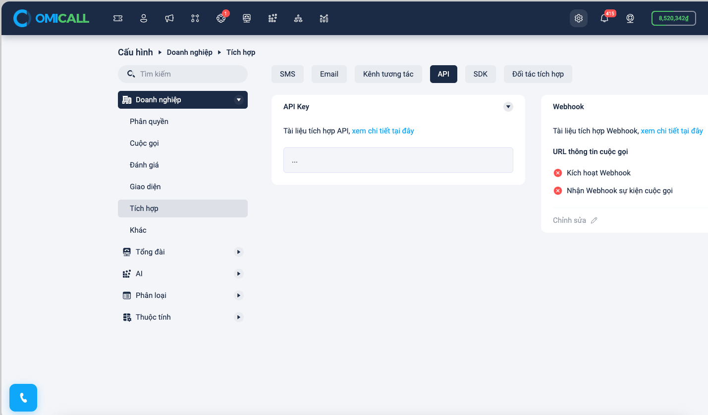

# Cài đặt

## Bạn có thể cài đặt bằng 2 cách&#x20;

### Cách 1: Cài đặt thủ công

* Tải  File cài đặt tại đây [https://github.com/VIHATTeam/OmiKit/archive/refs/tags/1.0.2.zip](https://github.com/VIHATTeam/OmiKit/archive/refs/tags/1.0.2.zip)
* Sau đó giải nén chúng ta được Framework như hình

<figure><figcaption></figcaption></figure>

* Bước tiếp theo click chuột vào thư mục OmiKit.xcframework sau đó kéo vào bất kỳ nơi nào của Project để sử dụng

<figure><figcaption></figcaption></figure>

* Bước cuối cùng cần vào phần cài đặt Target của Project để cấu hình framework chọn option Embed & Sign framework như hình:
*

    <figure><figcaption></figcaption></figure>

### Cách 2: Cài đặt tự động

Chúng ta sẽ sử dụng POD để cài đặt tự động&#x20;

Trong Podfile chúng ta khai báo bổ sung 1 dòng như sau:

_<mark style="color:blue;">pod 'OmiKit', :git => 'https://github.com/VIHATTeam/OmiKit.git'</mark>_

<figure><figcaption></figcaption></figure>

* Sau đó vào thư mục gốc chạy lệnh _pod install_ để cài đặt tự động

Sau bước cài đặt framework chúng ta đã có thể import vào để sử dụng:

&#x20;

<figure><figcaption></figcaption></figure>
