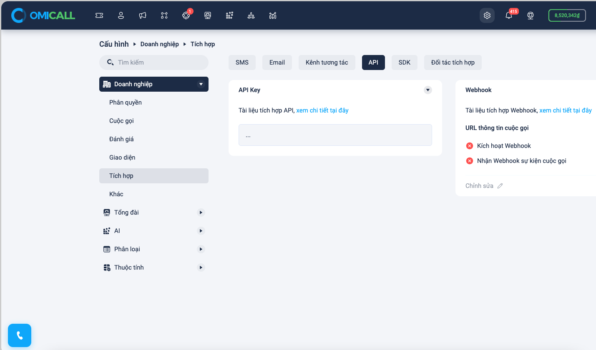

# Tài khoản đăng nhập

Mỗi nhân viên có một số nội bộ để thực hiện cuộc gọi , số này được cấu hình trong tổng đài, khi đăng nhập vào web/mobile app hệ thống sẽ tự lấy số nội bộ này đăng nhập cho bạn.

Đối với SDK chúng ta cần 3 trường thông tin để đăng nhập vào thực hiện cuộc gọi&#x20;

* user: số nội bộ&#x20;
* password: mật khẩu
* realm: domain tổng đài&#x20;

Các thông tin này tìm chúng ta có thể truy cập trong phần : Cấu hình -> Tổng Đài -> Số nội bộ -> Nhấn vào chi tiết 1 số nội bộ&#x20;

<figure><figcaption></figcaption></figure>
