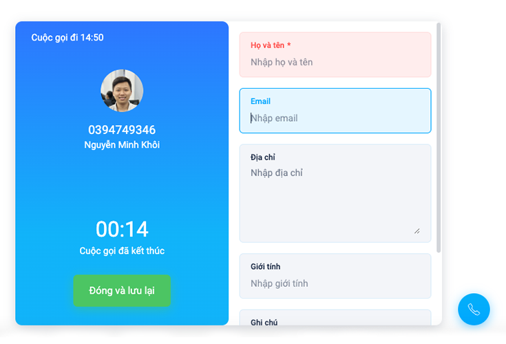

# Web SDK

```markup
Version : 2.0.0
Release date : 15/07/2021 22:00
Changelog : https://api.omicall.com/chang-log#26-05-2021
```

### Hướng dẫn cài đặt


.png>)




Nhúng Web SDK vào HTML của website cần tích hợp

```markup
<body>

    <!-- other html -->
    
    <script omi-sdk type="text/javascript" src="https://cdn.omicrm.com/sdk/2.0.0/sdk.min.js"></script>
    
    <script>
        document.addEventListener('DOMContentLoaded', () => {
            // Ví dụ về một số config có thể dùng khi init SDK
            let config = {
                theme: 'default',
                callbacks: {
                    register: (data) => {
                        // Sự kiện xảy ra khi trạng thái kết nối tổng đài thay đổi
                        console.log('register:', data);
                    },
                    connecting: (data) => {
                        // Sự kiện xảy ra khi bắt đầu thực hiện cuộc gọi ra
                        console.log('connecting:', data);
                    },
                    invite: (data) => {
                         // Sự kiện xảy ra khi có cuộc gọi tới
                         console.log('invite:', data);
                    },
                    inviteRejected: (data) => {
                         // Sự kiện xảy ra khi có cuộc gọi tới, nhưng bị tự động từ chối
                         // trong khi đang diễn ra một cuộc gọi khác
                         console.log('inviteRejected:', data);
                    },
                    ringing: (data) => {
                        // Sự kiện xảy ra khi cuộc gọi ra bắt đầu đổ chuông
                        console.log('ringing:', data);
                    },
                    accepted: (data) => {
                         // Sự kiện xảy ra khi cuộc gọi vừa được chấp nhận
                         console.log('accepted:', data);
                    },
                    incall: (data) => {
                         // Sự kiện xảy ra mỗi 1 giây sau khi cuộc gọi đã được chấp nhận
                         console.log('incall:', data);
                    },
                    acceptedByOther: (data) => {
                         // Sự kiện dùng để kiểm tra xem cuộc gọi bị kết thúc
                         // đã được chấp nhận ở thiết bị khác hay không
                         console.log('acceptedByOther:', data);
                    },
                    ended: (data) => {
                         // Sự kiện xảy ra khi cuộc gọi kết thúc
                         console.log('ended:', data);
                    },
                    holdChanged: (status) => {
                         // Sự kiện xảy ra khi trạng thái giữ cuộc gọi thay đổi
                         console.log('on hold:', status);
                    },
                    saveCallInfo: (data) => {
                        // let { callId, note, ...formData } = data;
                        // Sự kiện xảy ra khi cuộc gọi đã có đổ chuông hoặc cuộc gọi tới, khi user có nhập note input mặc định hoặc form input custom
                        console.log('on save call info:', data);
		    },
                }
            };
            omiSDK.init(config, () => {
                // nếu url login của bạn là: https://abc.omicall.com
                // và số nội bộ của bạn là 100 với password là 123456
                // thì param khi register sẽ là:
                // omiSDK.register({
                //    domain: 'abc',
                //    username: '100', 
                //    password: '123456'
                // });
                omiSDK.register({
                    domain: '',
                    username: '', // tương đương trường "sip_user" trong thông tin số nội bộ
                    password: ''
                });
            });
        });
    </script>

</body>
```


File demo tích hợp SDK



**Phương thức**

|                                                                                                                                     **Phương thức** | **Mô tả**                                                                                                                                                                                                                                                                                                                                                                                                                                                                                                                                                                                                                                                                                                                                                                                                                                                                                                                                                                                                                                                                                                                                                                 |
| --------------------------------------------------------------------------------------------------------------------------------------------------: | ------------------------------------------------------------------------------------------------------------------------------------------------------------------------------------------------------------------------------------------------------------------------------------------------------------------------------------------------------------------------------------------------------------------------------------------------------------------------------------------------------------------------------------------------------------------------------------------------------------------------------------------------------------------------------------------------------------------------------------------------------------------------------------------------------------------------------------------------------------------------------------------------------------------------------------------------------------------------------------------------------------------------------------------------------------------------------------------------------------------------------------------------------------------------- |
|                                                                                                                   omiSDK**.init(config, callback)** | Khởi tạo các cấu hình cần thiết cho SDK và load UI nếu có truyền theme                                                                                                                                                                                                                                                                                                                                                                                                                                                                                                                                                                                                                                                                                                                                                                                                                                                                                                                                                                                                                                                                                                    |
|                                                                                                                         omiSDK.**register(params)** | <ul><li>Gọi tới khi sau khi function SDK init callback.</li><li>Phương thức ghi danh tổng đài: <strong>Object</strong></li></ul><p><code>{</code><br>   <code>domain : "abc" // domain tổng dài</code></p><p>   <code>username: "100", // Số nội bộ</code></p><p>   <code>password: "***" // Mật khẩu số nội bộ</code></p><p><code>}</code></p><p></p><p><strong>*Lưu ý:</strong> Có thể lấy các thông tin ghi danh tổng đài ở cấu hình số nội bộ hoặc thông qua API của OMICall</p>                                                                                                                                                                                                                                                                                                                                                                                                                                                                                                                                                                                                                                                                                      |
|                                                                                                                             omiSDK.**unregister()** | Ngưng kết nối với tổng đài                                                                                                                                                                                                                                                                                                                                                                                                                                                                                                                                                                                                                                                                                                                                                                                                                                                                                                                                                                                                                                                                                                                                                |
|                                                                                                                       omiSDK.**reregister(params)** | Ngưng kết nối với tổng đài và tạo một phiên kết nối mới với params trước đó hoặc từ params mới truyền                                                                                                                                                                                                                                                                                                                                                                                                                                                                                                                                                                                                                                                                                                                                                                                                                                                                                                                                                                                                                                                                     |
|                                                                                                                         omiSDK.**makeCall(phone)**  | <p><strong>- phone</strong>:</p><ul><li>Số điện thoại khách hàng</li><li>Số nội bộ của nhân viên</li><li>Số nội bộ của nhóm</li><li>Số nội bộ của nhóm bên ngoài</li></ul>                                                                                                                                                                                                                                                                                                                                                                                                                                                                                                                                                                                                                                                                                                                                                                                                                                                                                                                                                                                                |
| <p>omiSDK.<strong>makeCall(phone, hotline)</strong><br><strong>or</strong><br><strong></strong>omiSDK.<strong>makeCall(phone, options)</strong></p> | <p><strong>- <code>phone</code></strong><code>:</code></p><ul><li>Số điện thoại khách hàng</li><li>Số nội bộ của nhân viên</li><li>Số nội bộ của nhóm</li><li>Số nội bộ của nhóm bên ngoài</li></ul><p>- <strong><code>hotline</code></strong><code> (String)</code><strong>:</strong> đầu số tổng đài dùng để gọi ra (*<strong>Lưu ý</strong>: phải là đầu số cho phép gọi ra và tài khoản nhân viên thực hiện cuộc gọi được quyền sử dụng đầu số này)<br>- <strong><code>options</code></strong><code> (Object)</code><strong>:</strong> <br> <strong></strong> {<br>   <strong>sipNumber</strong>: String,</p><p>   <strong>sneakyType</strong>: String,<br>   <strong>datas</strong>: Object<br> }<br>  + <strong>sipNumber:</strong> như param <strong>hotline</strong> cũ<br>  + <strong>sneakyType</strong>: loại cuộc gọi giám giát số nội bộ khác, gồm: <br>     > <strong>monitoring</strong>: Giám sát <br>     > <strong>whisper</strong>: Thì thầm<br>     > <strong>colloquy</strong>: Đàm thoại 3 bên<br>  + <strong>datas:</strong> dữ liệu truyền lên tổng đài để lưu thêm dữ liệu tuỳ chỉnh vào lịch sử cuộc gọi, max length của string data là 256</p> |
|                                                                                                                               omiSDK.**stopCall**() | Kết thúc cuộc gọi                                                                                                                                                                                                                                                                                                                                                                                                                                                                                                                                                                                                                                                                                                                                                                                                                                                                                                                                                                                                                                                                                                                                                         |
|                                                                                                                             omiSDK.**rejectCall()** | Từ chối cuộc gọi (trong trường hợp không muốn nhận)                                                                                                                                                                                                                                                                                                                                                                                                                                                                                                                                                                                                                                                                                                                                                                                                                                                                                                                                                                                                                                                                                                                       |
|                                                                                                                             omiSDK.**acceptCall**() | Chấp nhận cuộc gọi                                                                                                                                                                                                                                                                                                                                                                                                                                                                                                                                                                                                                                                                                                                                                                                                                                                                                                                                                                                                                                                                                                                                                        |
|                                                                                                                  omiSDK.**transferCall(extension)** | <p>Chuyển tiếp cuộc gọi. </p><p><strong>extension</strong> : Là số máy lẻ nhân viên cần chuyển tới</p>                                                                                                                                                                                                                                                                                                                                                                                                                                                                                                                                                                                                                                                                                                                                                                                                                                                                                                                                                                                                                                                                    |
|                                                                                                                           omiSDK.**sendDTMF(tone)** | <p>Gửi tín hiệu tương tác bấm phím</p><p><strong>tone</strong>: các số từ 0-9 hoặc *#</p>                                                                                                                                                                                                                                                                                                                                                                                                                                                                                                                                                                                                                                                                                                                                                                                                                                                                                                                                                                                                                                                                                 |
|                                                                                                                       omiSDK.**toggleMute(status)** | <p>Bật tắt âm thanh từ micro của bạn</p><p><strong>status:</strong></p><ul><li><strong>true</strong>: tắt âm thanh</li><li><strong>false</strong>: bật âm thanh</li></ul>                                                                                                                                                                                                                                                                                                                                                                                                                                                                                                                                                                                                                                                                                                                                                                                                                                                                                                                                                                                                 |
|                                                                                                                       omiSDK.**toggleHold(status)** | <p>Thay đổi trạng thái giữ cuộc gọi</p><p><strong>status:</strong></p><ul><li><strong>true</strong>: giữ cuộc gọi</li><li><strong>false</strong>: bỏ giữ cuộc gọi</li></ul>                                                                                                                                                                                                                                                                                                                                                                                                                                                                                                                                                                                                                                                                                                                                                                                                                                                                                                                                                                                               |
|                                                                                                                              omiSDK.**getStatus()** | <p>Lấy trạng thái kết nối hiện tại của SDK với tổng đài:</p><ul><li><strong>registering</strong>: đang kết nối</li><li><strong>registered</strong>: đã kết nối</li><li><strong>unregistered</strong>: chưa kết nối</li></ul>                                                                                                                                                                                                                                                                                                                                                                                                                                                                                                                                                                                                                                                                                                                                                                                                                                                                                                                                              |
|                                                                                                                           omiSDK.**toggleDialog()** | Chủ động ẩn hiện dialog cuộc gọi của SDK nếu có sử dụng theme                                                                                                                                                                                                                                                                                                                                                                                                                                                                                                                                                                                                                                                                                                                                                                                                                                                                                                                                                                                                                                                                                                             |
|                                                                                                                              omiSDK.**isCalling**() | Trả về giá trị true/false                                                                                                                                                                                                                                                                                                                                                                                                                                                                                                                                                                                                                                                                                                                                                                                                                                                                                                                                                                                                                                                                                                                                                 |
|                                                                                                                omiSDK.**updateContactInfo**(Object) | <p>Cập nhật Tên và Avatar của khách hàng trên cửa số cuộc gọi</p><p><em></em></p><p><em>omiSDK.<strong>updateContactInfo</strong>({</em></p><p>   <em>name : "Nguyễn Thanh Sang",</em></p><p>   <em>avatar : "https://...."</em></p><p><em>});</em></p><p><em></em></p><p><em>*G</em>iá trị <strong>avatar</strong> sẽ được truyền vào thuộc tính <code>src</code> của thẻ <code>img</code>: có thẻ là http link hoặc base64,...</p>                                                                                                                                                                                                                                                                                                                                                                                                                                                                                                                                                                                                                                                                                                                                      |
|                                                                                                                         omiSDK.**getAccessToken**() | Trả về **accessToken** của phiên kết nối tổng đài hiện tại, có thể dùng để gọi các API public của OMI                                                                                                                                                                                                                                                                                                                                                                                                                                                                                                                                                                                                                                                                                                                                                                                                                                                                                                                                                                                                                                                                     |
|                                                                                                                 omiSDKTheme.**setFormData**(Object) | Set value cho các text input với id tương ứng khi truyền mảng "forms" trong cấu hình                                                                                                                                                                                                                                                                                                                                                                                                                                                                                                                                                                                                                                                                                                                                                                                                                                                                                                                                                                                                                                                                                      |


**Dữ liệu callback từ sự kiện**

| **Tham số**                     | **Loại**   | **Mô tả**                                                                                                                                                                                                                                                                                                                                                                                                                                   |
| ------------------------------- | ---------- | ------------------------------------------------------------------------------------------------------------------------------------------------------------------------------------------------------------------------------------------------------------------------------------------------------------------------------------------------------------------------------------------------------------------------------------------- |
| **direction**                   | **String** | Hướng của cuộc gọi: **`outbound, inbound`**                                                                                                                                                                                                                                                                                                                                                                                                 |
| **directionTxt**                | **String** | Tên hướng của cuộc gọi                                                                                                                                                                                                                                                                                                                                                                                                                      |
| **status**                      | **String** | Trạng thái hiện tại của cuộc gọi: **`connecting, ringing, connected, ended, hold`**                                                                                                                                                                                                                                                                                                                                                         |
| **statusTxt**                   | **String** | Tên trạng thái hiện tại của cuộc gọi                                                                                                                                                                                                                                                                                                                                                                                                        |
| **remoteNumber** hoặc **phone** | **String** | <ul><li>với <strong>direction outbound</strong>: số được gọi ra</li><li>với <strong>direction inbound</strong>: số đang gọi tới</li></ul>                                                                                                                                                                                                                                                                                                   |
| **sipDomain**                   | **String** | Domain tổng đài của phiên kết nối hiện tại                                                                                                                                                                                                                                                                                                                                                                                                  |
| **sipUser**                     | **String** | Số nội bộ của phiên kết nối hiện tại                                                                                                                                                                                                                                                                                                                                                                                                        |
| **sipNumber**                   | **String** | Số tổng đài đang dùng để thực hiện cuộc gọi ra hay nhận cuộc gọi tới                                                                                                                                                                                                                                                                                                                                                                        |
| **startTime**                   | **Date**   | Thời gian bắt đầu cuộc gọi                                                                                                                                                                                                                                                                                                                                                                                                                  |
| **answerTime**                  | **Date**   | Thời gian bắt đầu chấp nhận cuộc gọi                                                                                                                                                                                                                                                                                                                                                                                                        |
| **endTime**                     | **Date**   | Thời gian kết thúc cuộc gọi                                                                                                                                                                                                                                                                                                                                                                                                                 |
| **endCause**                    | **String** | <p>Nguyễn nhân kết thúc cuộc gọi.</p><p>Gồm:</p><ul><li><strong>BUSY</strong>: máy bận</li><li><strong>NO_ANSWER</strong>: hết thời gian đổ chuông</li><li><strong>TRIAL_REJECTION</strong>: khi gọi tới số điện thoại chưa gọi vào số tổng tài (với tài khoản OMI Trial)</li><li><strong>LIMITATION_DECLINE</strong>: quá thời lượng cho phép gọi ra</li><li><strong>ALLOTTED_TIMEOUT</strong>: Cuộc gọi đạt giới hạn thời lượng</li></ul> |
| **uuid**                        | **String** | **Transaction ID** của cuộc gọi                                                                                                                                                                                                                                                                                                                                                                                                             |
| **duration**                    | **Number** | Thời gian gọi giữa 2 người sau khi chấp nhận cuộc gọi cho tới khi cuộc gọi kết thúc                                                                                                                                                                                                                                                                                                                                                         |
| **durationTxt**                 | **String** | Thời gian gọi giữa 2 người sau khi chấp nhận cuộc gọi cho tới khi cuộc gọi kết thúc và đã được định dạng theo thời gian: **`00:00`**                                                                                                                                                                                                                                                                                                        |
| **totalDuration**               | **Number** | Tổng thời gian từ khi bắt đầu thực hiện/nhận cuộc gọi tới khi kết thúc                                                                                                                                                                                                                                                                                                                                                                      |
| **ping**                        | **Object** | Dữ liệu về trạng thái tín hiệu của cuộc gọi                                                                                                                                                                                                                                                                                                                                                                                                 |


**Cấu hình và Sự kiện**

|              config.**theme** | **String**          | <p>Giao diện dialog cuộc gọi (nếu để trống thì sẽ không có giao diện). Hoặc một trong các giá trị sau </p><ul><li><strong>default</strong> : Giao diện (như ảnh ở trên)</li></ul>                                                                                                                                                                                                                                                                                                                                                                                                                                                                                                                                                                                                                                                                                                                                                                                                          |
| ----------------------------: | ------------------- | ------------------------------------------------------------------------------------------------------------------------------------------------------------------------------------------------------------------------------------------------------------------------------------------------------------------------------------------------------------------------------------------------------------------------------------------------------------------------------------------------------------------------------------------------------------------------------------------------------------------------------------------------------------------------------------------------------------------------------------------------------------------------------------------------------------------------------------------------------------------------------------------------------------------------------------------------------------------------------------------ |
|              config.**debug** | **Boolean**         | <p>Bật tắt chức năng log các sự kiện của SDK.</p><p>Mặc định: <strong>false</strong></p>                                                                                                                                                                                                                                                                                                                                                                                                                                                                                                                                                                                                                                                                                                                                                                                                                                                                                                   |
|               config.**busy** | **Boolean**         | Trạng thái cho phép thực hiện cuộc gọi ra, nhưng sẽ tự động từ chối tất cả các cuộc gọi tới                                                                                                                                                                                                                                                                                                                                                                                                                                                                                                                                                                                                                                                                                                                                                                                                                                                                                                |
|           config.**language** | **String**          | <p>Ngôn ngữ hiển thị dialog cuộc gọi mặc định của SDK.</p><p>Gồm: <br> "<strong>vi</strong>" : Tiếng Việt (<strong>default</strong>)<br> "<strong>en</strong>" : Tiếng anh</p>                                                                                                                                                                                                                                                                                                                                                                                                                                                                                                                                                                                                                                                                                                                                                                                                             |
|     config.**ringtoneVolume** | **Number**          | Âm lượng chuông, khi khách gọi tới (từ 0 - 1)                                                                                                                                                                                                                                                                                                                                                                                                                                                                                                                                                                                                                                                                                                                                                                                                                                                                                                                                              |
|            config.**options** | **Object**          | <ul><li><em><strong><code>hideCallButton</code></strong></em><code>: </code><strong><code>Boolean</code></strong> Ẩn hiện nút gọi</li></ul><ul><li><strong><code>showContactLoading</code></strong><code>:</code><strong><code>Boolean</code></strong> Ẩn hiện loading vị trí tên của người gọi trong dialog cuộc gọi</li><li><strong><code>maskedPhoneNumberFormat: Array</code></strong> tùy chỉnh format ẩn số điện thoại ở dialog gọi.<br><strong>E.g.</strong>:<br>- <strong><code>['start', 4, 'x']</code></strong> => <strong>xxxx749346</strong><br>- <strong><code>['end', 3, 'x']</code></strong> => <strong>0394749xxx</strong></li><li><strong><code>draggable: Boolean</code></strong> để cho phép để thay đổi vị trí của nút bật tắt dialog call và dialog cuộc gọi</li><li><strong><code>btnCloseText: String</code></strong> để tuỳ chỉnh nội dung chữ của nút đóng và lưu lại cuộc gọi nếu có hiển thị input note hoặc custom forms</li></ul>                             |
|              config.**forms** | **Array \[Object]** | <p>Mảng form data tuỳ chỉnh. </p><ul><li><strong>id</strong>: ID định danh của field input</li><li><strong>label</strong>: Tên của field input</li><li><strong>plh</strong>: placeholder của input</li><li><strong>multiline</strong>: hiện thị input dạng textarea</li><li><strong>required</strong>: thêm dấu <mark style="color:red;">*</mark> bên cạnh tên của input và chặn đóng dialog call khi chưa nhập input</li><li><strong>className</strong>: class tuỳ chỉnh truyền vào div ngoài cùng của field input</li><li><strong>height</strong>: chiều cao tuỳ chỉnh cho input multiline</li></ul><p>*Ví dụ: <br>{</p><p>   <strong>id</strong>: 'address', <em>=> bắt buộc</em><br>   <strong>label</strong>: 'Địa chỉ',<br>   <strong>plh</strong>: 'Nhập địa chỉ',<br>   <strong>multiline</strong>: <em>true/fasle</em>,<br>   <strong>required</strong>: <em>true/fasle</em>,<br>   <strong>className</strong>: <em>String</em>,<br>   <strong>height</strong>: '200px',<br>}</p> |
|            config.**classes** | **Object**          | <ul><li><strong><code>btnToggle</code></strong><code>:</code><strong><code>String</code></strong> được truyền vào thuộc tính <strong><code>class</code></strong> của div ngoài cùng của button đóng mở UI cuộc gọi</li><li><strong><code>dialog</code></strong><code>:</code><strong><code>String</code></strong> được truyền vào thuộc tính <strong><code>class</code></strong> của div ngoài cùng của dialog UI cuộc gọi</li></ul>                                                                                                                                                                                                                                                                                                                                                                                                                                                                                                                                                       |
|             config.**styles** | **Object**          | <p></p><ul><li><strong><code>btnToggle</code></strong><code>:</code><strong><code>Object</code></strong> được truyền vào thuộc tính <strong><code>style</code></strong> của div ngoài cùng của button đóng mở UI cuộc gọi</li><li><strong><code>dialog</code></strong><code>:</code><strong><code>Object</code></strong> được truyền vào thuộc tính <strong><code>style</code></strong> của div ngoài cùng của dialog UI cuộc gọi</li></ul><p><strong>E.g. Object style</strong>:<br>{<br>   'background-color': 'blue',<br>   justifyContent: 'center',          <br>   color: 'red'<br>}, </p>                                                                                                                                                                                                                                                                                                                                                                                           |
|          config.**callbacks** | **Object**          | Object chứa các event function callback                                                                                                                                                                                                                                                                                                                                                                                                                                                                                                                                                                                                                                                                                                                                                                                                                                                                                                                                                    |
|        callbacks.**register** | **Function**        | Sự kiện xảy ra khi trạng thái kết nối tổng đài thay đổi                                                                                                                                                                                                                                                                                                                                                                                                                                                                                                                                                                                                                                                                                                                                                                                                                                                                                                                                    |
|      callbacks.**connecting** | **Function**        | Sự kiện xảy ra khi bắt đầu thực hiện cuộc gọi ra                                                                                                                                                                                                                                                                                                                                                                                                                                                                                                                                                                                                                                                                                                                                                                                                                                                                                                                                           |
|          callbacks.**invite** | **Function**        | Sự kiện xảy ra khi có cuộc gọi tới                                                                                                                                                                                                                                                                                                                                                                                                                                                                                                                                                                                                                                                                                                                                                                                                                                                                                                                                                         |
|  callbacks.**inviteRejected** | **Function**        | Sự kiện xảy ra khi có cuộc gọi tới, nhưng bị tự động từ chối                                                                                                                                                                                                                                                                                                                                                                                                                                                                                                                                                                                                                                                                                                                                                                                                                                                                                                                               |
|         callbacks.**ringing** | **Function**        | Sự kiện xảy ra khi cuộc gọi ra bắt đầu đổ chuông                                                                                                                                                                                                                                                                                                                                                                                                                                                                                                                                                                                                                                                                                                                                                                                                                                                                                                                                           |
|        callbacks.**accepted** | **Function**        | Sự kiện xảy ra khi cuộc gọi vừa được chấp nhận                                                                                                                                                                                                                                                                                                                                                                                                                                                                                                                                                                                                                                                                                                                                                                                                                                                                                                                                             |
|          callbacks.**incall** | **Function**        | Sự kiện xảy ra mỗi 1 giây sau khi cuộc gọi đã được chấp nhận                                                                                                                                                                                                                                                                                                                                                                                                                                                                                                                                                                                                                                                                                                                                                                                                                                                                                                                               |
| callbacks.**acceptedByOther** | **Function**        | Sự kiện dùng để kiểm tra xem cuộc gọi bị kết thúc, đã được chấp nhận ở thiết bị khác hay không                                                                                                                                                                                                                                                                                                                                                                                                                                                                                                                                                                                                                                                                                                                                                                                                                                                                                             |
|           callbacks.**ended** | **Function**        | Sự kiện xảy ra khi cuộc gọi kết thúc                                                                                                                                                                                                                                                                                                                                                                                                                                                                                                                                                                                                                                                                                                                                                                                                                                                                                                                                                       |
|     callbacks.**holdChanged** | **Function**        | Sự kiện xảy ra khi trạng thái giữ cuộc gọi thay đổi                                                                                                                                                                                                                                                                                                                                                                                                                                                                                                                                                                                                                                                                                                                                                                                                                                                                                                                                        |
|    callbacks.**saveCallInfo** | **Function**        | Sự kiện xảy ra khi cuộc gọi đã có đổ chuông hoặc cuộc gọi tới, khi user có nhập note input mặc định hoặc form input custom                                                                                                                                                                                                                                                                                                                                                                                                                                                                                                                                                                                                                                                                                                                                                                                                                                                                 |

